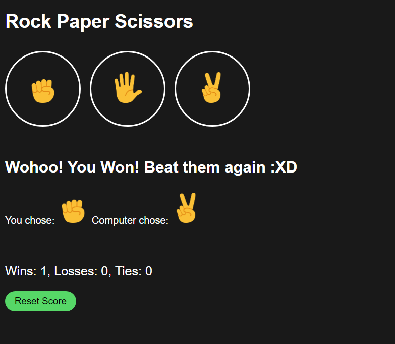

# Rock, Paper, Scissors Game

Welcome to the Rock, Paper, Scissors game! This simple web-based game is implemented using HTML, CSS, and JavaScript. Test your luck and strategy against the computer in this classic hand game.

## Table of Contents

- [Getting Started](#getting-started)
- [How to Play](#how-to-play)
- [Features](#features)
- [Contributing](#contributing)
- [License](#license)

## Getting Started

To play the Rock, Paper, Scissors game, follow these steps:

1. Clone this repository to your local machine or download it as a ZIP file.

https://github.com/ShivamGupta-yo/Rock-Paper-Scissors.git

2. Open the `index.html` file in your preferred web browser.

3. Enjoy the game!

## How to Play

Playing Rock, Paper, Scissors is easy:

1. Click on one of the three hand symbols (Rock, Paper, or Scissors) to make your choice.
   
   
   
   

2. The computer will randomly select its choice.

3. The winner is determined according to the following rules:
   - Rock beats Scissors
   - Scissors beats Paper
   - Paper beats Rock
   - If both you and the computer choose the same option, it's a tie!

4. The game will display the result, update the scores, and you can play again.

## Features

- Simple and intuitive user interface.
- Realistic hand symbols for Rock, Paper, and Scissors.
- Random computer selections for a fair game.
- Keeps track of the score to see who is winning.

## Contributing

Contributions to this Rock, Paper, Scissors game are welcome! If you'd like to contribute, please follow these steps:

1. Fork the repository.

2. Create a new branch for your feature or bug fix.

   
   git checkout -b feature-name
  ]

3. Make your changes and commit them with a descriptive commit message.

   
   git commit -m "Add feature or fix bug"
  

4. Push your changes to your fork.

   git push origin feature-name
  

5. Create a pull request to the `main` branch of this repository.

We appreciate your contributions!

## License

Write Now this game is not licensed, so keep enjoying!

---

Enjoy the game, and have fun playing Rock, Paper, Scissors! If you have any questions or suggestions, please feel free to open an issue or reach out to us. Thanks for playing!